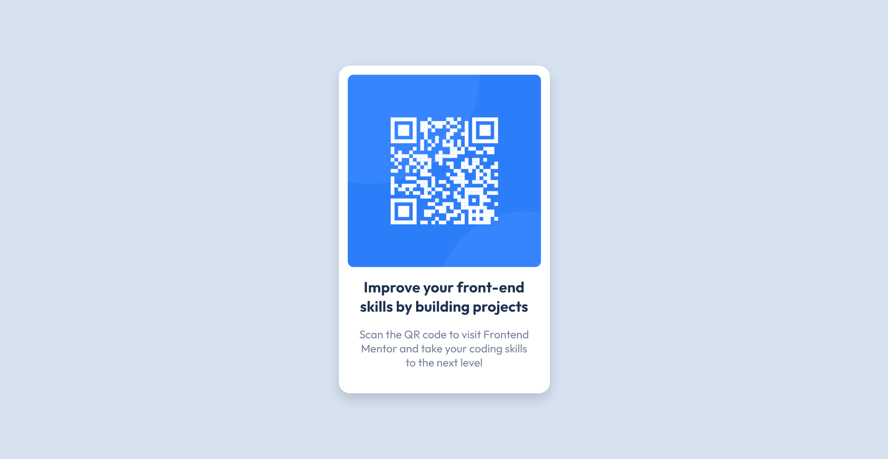

# Frontend Mentor - QR code component

# Frontend Mentor - QR code component solution

This is a solution to the [QR code component challenge on Frontend Mentor](https://www.frontendmentor.io/challenges/qr-code-component-iux_sIO_H). Frontend Mentor challenges help you improve your coding skills by building realistic projects. 

## Table of contents

- [Frontend Mentor - QR code component](#frontend-mentor---qr-code-component)
- [Frontend Mentor - QR code component solution](#frontend-mentor---qr-code-component-solution)
  - [Table of contents](#table-of-contents)
  - [Overview](#overview)
    - [Screenshot](#screenshot)
    - [Links](#links)
  - [My process](#my-process)
    - [Built with](#built-with)
  - [Author](#author)

## Overview

### Screenshot

### Links

- Solution URL: https://github.com/ratul16/frontend-mentor-challenge/tree/main/qr-code-component
- Live Site URL: https://ratul16.github.io/frontend-mentor-challenge/qr-code-component/

## My process

### Built with

- Semantic HTML5 markup
- CSS Variables
- Flexbox
- Box-shadow

## Author

- Website - https://ratul16.netlify.app/
- Frontend Mentor - [@ratul16](https://www.frontendmentor.io/profile/ratul16)
- LinkedIn - [@ratul16](https://www.linkedin.com/in/ratul16/)

